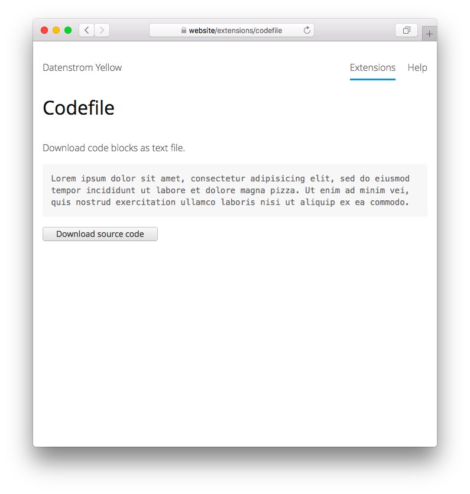

<p align="right"><a href="README-de.md">Deutsch</a> &nbsp; <a href="README.md">English</a></p>

# Codefile 0.9.1

Download code blocks as text file.

<p align="center"></p>

## How to install an extension

[Download ZIP file](https://github.com/schulle4u/yellow-extensions-schulle4u/raw/main/downloads/codefile.zip) and copy it into your `system/extensions` folder. [Learn more about extensions](https://github.com/annaesvensson/yellow-update).

## How to download a code block

Use special markdown attributes to Prepare your code block with an ID and create a `[codefile]` shortcut. 

The following arguments are available, all arguments are optional:
 
`Id` = ID of the code block, e.g. `codefile`  
`FileName` = file name of the downloaded code block  

This extension can be used to download code blocks as text file, useful to provide a file download for ready-to-use code examples. Please use fenced code blocks, indented blocks and code between backticks are not supported. 

## Examples

Content file with downloadable code block:

    ---
    Title: Example
    ----
    This is an example page. 
    
    ``` {#codefile contenteditable=true}
    Lorem ipsum dolor sit amet, consectetur adipisicing elit, sed do eiusmod 
    tempor incididunt ut labore et dolore magna pizza. Ut enim ad minim veniam, 
    quis nostrud exercitation ullamco laboris nisi ut aliquip ex ea commodo. 
    ```

    [codefile]

Use a custom ID and file name:

    [codefile code-example]
    [codefile code-example example.php]

## Acknowledgements

The Javascript component is based on a tutorial from [GeeksForGeeks](https://www.geeksforgeeks.org/how-to-trigger-a-file-download-when-clicking-an-html-button-or-javascript/). Thanks for the code!

## Developer

Steffen Schultz. [Get help](https://datenstrom.se/yellow/help/).
