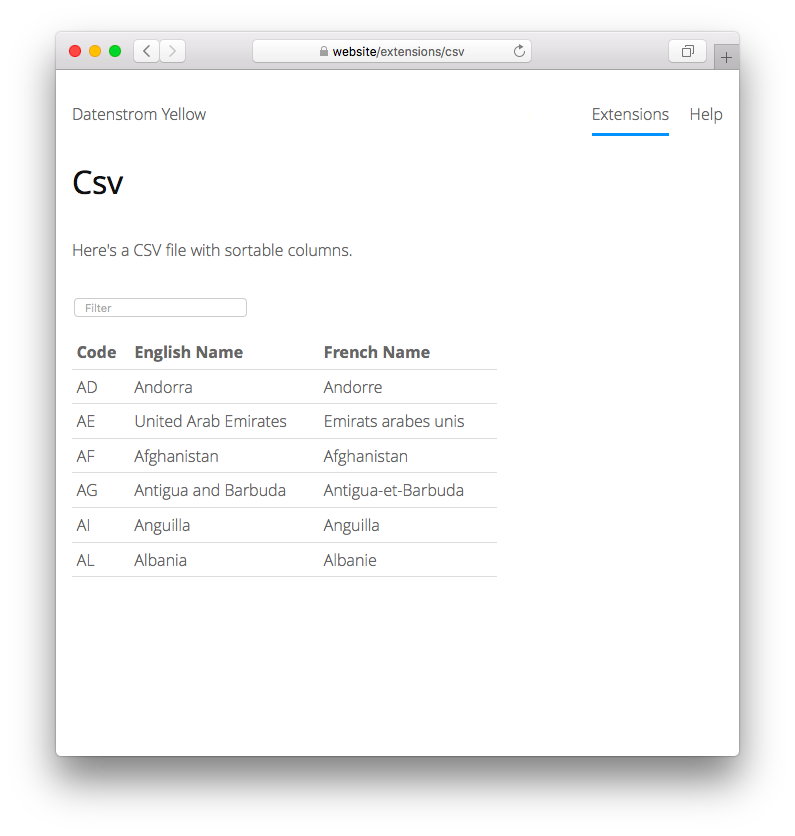

<p align="right"><a href="README-de.md">Deutsch</a> &nbsp; <a href="README.md">English</a></p>

# Csv 0.8.18

CSV-Dateileser.

<p align="center"></p>

## Wie man eine Erweiterung installiert

[ZIP-Datei herunterladen](https://github.com/schulle4u/yellow-extensions-schulle4u/raw/main/downloads/csv.zip) und in dein `system/extensions`-Verzeichnis kopieren. [Weitere Informationen zu Erweiterungen](https://github.com/annaesvensson/yellow-update/tree/main/README-de.md).

## Wie man eine CSV-Datei anzeigt

Erstelle eine `[csv]`-Abkürzung. 

Die folgenden Argumente sind verfügbar, mit Ausnahme des ersten Arguments sind alle Angaben optional:

`FileName` = Name der CSV-Datei  
`Class` = Klasse für die HTML-Tabelle  

Diese Erweiterung lädt eine CSV-Datei und gibt sie als HTML-Tabelle aus. Für umfangreiche Datensätze stehen ein Zeilenfilter sowie Spaltensortierung zur Verfügung. Des Weiteren können CSV-Daten mittels eines Code-Blocks in markdown geladen werden. 

## Beispiele

Grundsätzliche Verwendung:

    [csv tapes.csv]

Benutzerdefinierte Klasse: 

    [csv tapes.csv MyTapes]

Spaltensortierung einschalten: 

    [csv tapes.csv "MyTapes js-sort-table"]

Einen Markdown-Code-Block zum Anzeigen von CSV-Daten benutzen: 

    ``` csv {.js-sort-table}
    Code,English Name,French Name
    AD,Andorra,Andorre
    AE,United Arab Emirates,Emirats arabes unis
    AF,Afghanistan,Afghanistan
    AG,Antigua and Barbuda,Antigua-et-Barbuda
    AI,Anguilla,Anguilla
    AL,Albania,Albanie
    ```

## Einstellungen

Die folgenden Einstellungen können in der Datei `system/extensions/yellow-system.ini` vorgenommen werden:

`CsvDirectory` = Verzeichnis für CSV-Dateien  
`CsvDelimiter` = Spaltentrenner, `auto` für automatische Erkennung  
`CsvFirstRowHeader` = Benutze die erste Zeile der CSV-Datei als Spaltenüberschrift, 1 oder 0  
`CsvFilter` = Zeigt ein Suchfeld zum Filtern der Tabellenzeilen an, 1 oder 0  

## Danksagung

Diese Erweiterung enthält [Light-table-filter](https://codepen.io/chriscoyier/pen/tIuBL) von Chris Coyier sowie [Sort-table class](https://github.com/stationer/SortTable) von Tyler Uebele, des Weiteren Code-Beiträge von Mark. Vielen Dank für die Arbeit!

## Entwickler

Steffen Schultz. [Hilfe finden](https://datenstrom.se/de/yellow/help/).
