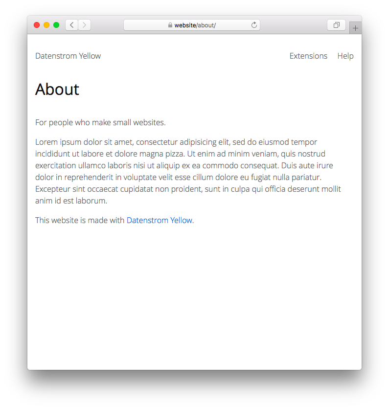

<p align="right"><a href="README-de.md">Deutsch</a> &nbsp; <a href="README.md">English</a></p>

# Profile 0.8.12

Author profile for blog pages. 

<p align="center"></p>

## How to install an extension

[Download ZIP file](https://github.com/schulle4u/yellow-extensions-schulle4u/raw/main/downloads/profile.zip) and copy it into your `system/extensions` folder. [Learn more about extensions](https://github.com/annaesvensson/yellow-update).

## How to create author profiles

Create a `[profile]` shortcut. 

The following arguments are available, all arguments are optional:

`Location` = location of author's page   
`Style` = profile style  

If the [blog extension](https://github.com/annaesvensson/yellow-blog) is installed, author notes will automatically be inserted after each article. Use `Profile: author` in your page settings to specify a different profile. 

Edit the file `content/profile/page.md` like you would do with a normal page. Write down a few notes about you. If you want an extended profile page, it is recommended to use a page break. You can create profile pages for every site author in the same directory. 

## Examples

Content file with author profile:

```
---
Title: Author profile
---
For people who make small websites. [--more--]

Lorem ipsum dolor sit amet, consectetur adipisicing elit, sed do eiusmod tempor incididunt ut 
labore et dolore magna pizza. Ut enim ad minim veniam, quis nostrud exercitation ullamco laboris 
nisi ut aliquip ex ea commodo consequat. Duis aute irure dolor in reprehenderit in voluptate velit 
esse cillum dolore eu fugiat nulla pariatur. Excepteur sint occaecat cupidatat non proident, sunt 
in culpa qui officia deserunt mollit anim id est laborum.

This website is made with [Datenstrom Yellow](https://datenstrom.se/yellow/).
```

Display individual author profiles:

    [profile yourname]
    [profile someone]

## Settings

The following settings can be configured in file `system/extensions/yellow-system.ini`:

`ProfileLocation` = location for author profiles  
`ProfileStyle` = default profile style  

## Acknowledgements

Thanks to the Datenstrom Yellow community for help and feedback!

## Developer

Steffen Schultz. [Get help](https://datenstrom.se/yellow/help/).
