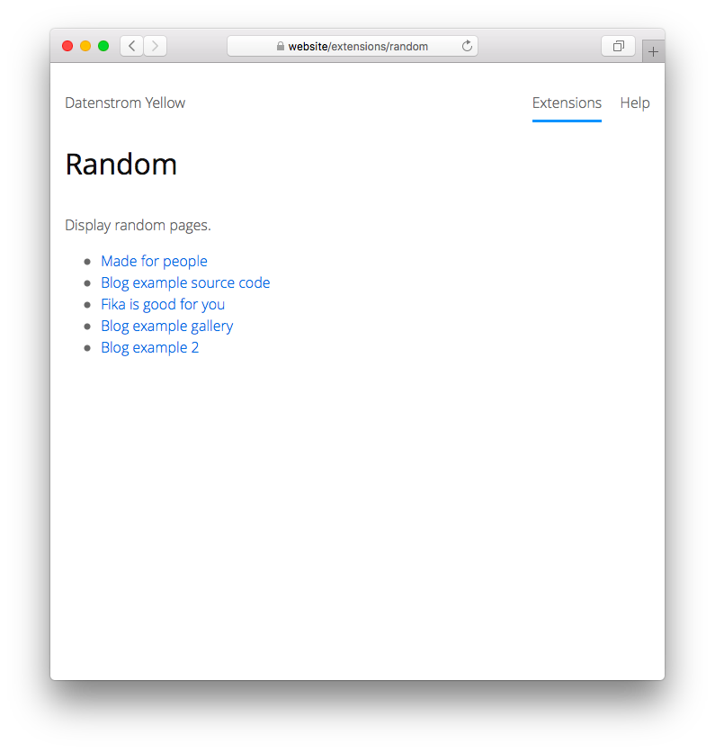

<a href="README-de.md">Deutsch</a> &nbsp; <a href="README.md">English</a>

# Random 0.8.10

Display random pages.

## How to install an extension

[Download ZIP file](https://github.com/schulle4u/yellow-extensions-schulle4u/raw/main/downloads/random.zip) and copy it into your `system/extensions` folder. [Learn more about extensions](https://github.com/annaesvensson/yellow-update).

## How to display random pages

Create a `[random]` shortcut. 

The following arguments are available, all but the first argument are optional:

`Location` = location of random pages  
`ShortcutEntries` = number of random pages to show  
`Mode` = display mode for random pages, e.g. `full`, `teaser`, `list`   

In `full` and `teaser` mode the page title and content are embedded into the current page. This can be useful to display e.g. random quotes, teasers or pictures. The `list` mode creates a clickable list of random pages, useful e.g. in a blog sidebar. 

## Examples

Selects a random page from a collection of quotes and displays the content:

    [random /quotes/ 1 full]

Lists 5 randomly selected blog posts:

    [random /blog/ 5 list]

Show a random page in teaser mode: 

    [random /products/ 1 teaser]

## Acknowledgements

Thanks to the Datenstrom Yellow community for help and feedback!

## Developer

Steffen Schultz. [Get help](https://datenstrom.se/yellow/help/).
