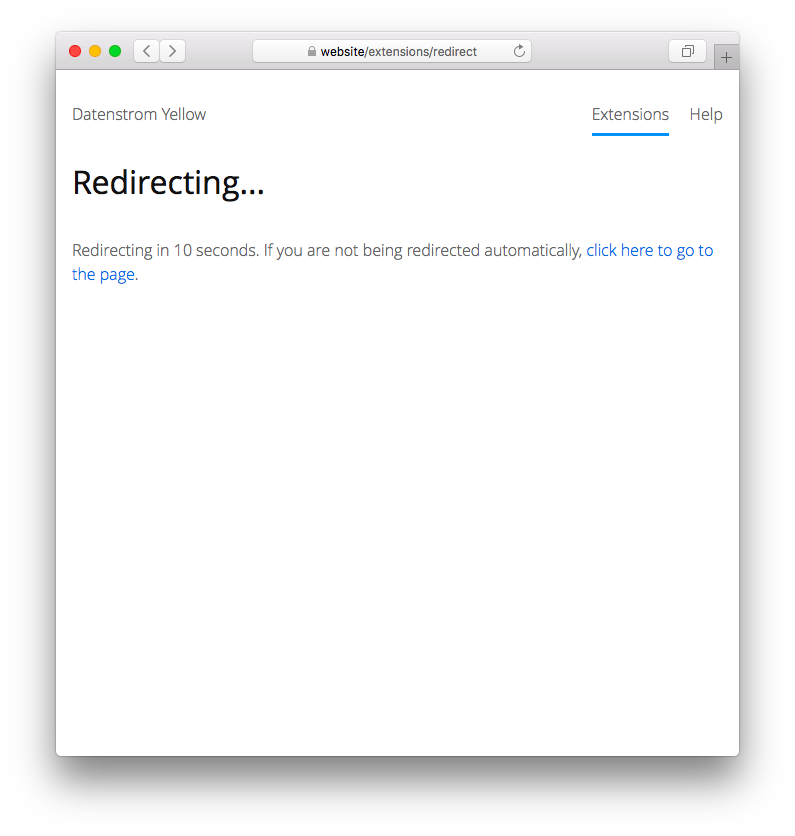

<p align="right"><a href="README-de.md">Deutsch</a> &nbsp; <a href="README.md">English</a></p>

# Redirect 0.8.5

Alternative Seitenweiterleitung.

<p align="center"></p>

## Wie man eine Erweiterung installiert

[ZIP-Datei herunterladen](https://github.com/schulle4u/yellow-extensions-schulle4u/raw/main/downloads/redirect.zip) und in dein `system/extensions`-Verzeichnis kopieren. [Weitere Informationen zu Erweiterungen](https://github.com/annaesvensson/yellow-update/tree/main/README-de.md).

## Wie man eine Weiterleitung erstellt

Verwende die folgenden Seiten-Einstellungen: 

`RedirectLocation` = Ziel für die Weiterleitung, z. B. `https://datenstrom.se`  
`RedirectTime` = Anzahl Sekunden bis zur Weiterleitung  

Erstelle optional eine `[redirect]`-Abkürzung, um einen Countdown für Besucher anzuzeigen. 

Diese Erweiterung stellt eine alternative Weiterleitungsfunktion auf andere Seiten oder URLs zur Verfügung. Im Gegensatz zu Datenstrom Yellows [eingebauter Weiterleitung](https://github.com/annaesvensson/yellow-core/tree/main/README-de.md) können Besucher vor der Weiterleitung erfahren, wohin sie weitergeleitet werden. 

## Beispiele

Inhaltsdatei mit Weiterleitung:

```
---
Title: Weiterleitung...
RedirectLocation: https://datenstrom.se
RedirectTime: 10
---
Weiterleitung in [refresh] Sekunden. Falls du nicht automatisch weitergeleitet wirst, [klicke hier, um die Seite zu öffnen](https://datenstrom.se).
```

## Einstellungen

Die folgenden Einstellungen können in der Datei `system/extensions/yellow-system.ini` vorgenommen werden:

`RedirectTime` = Zeit in Sekunden bis zur Weiterleitung  

## Danksagung

Vielen Dank an die Datenstrom-Yellow-Gemeinschaft für Hilfe und Feedback!

## Entwickler

Steffen Schultz. [Hilfe finden](https://datenstrom.se/de/yellow/help/).
